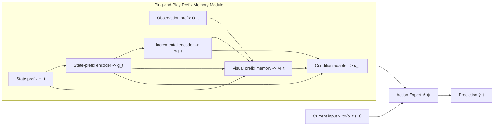
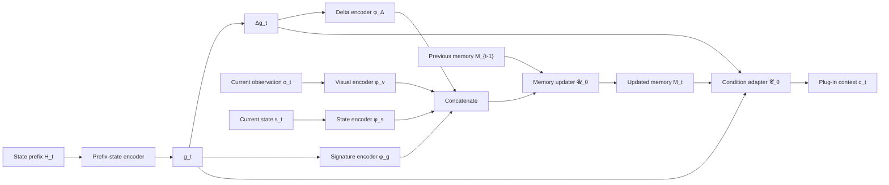
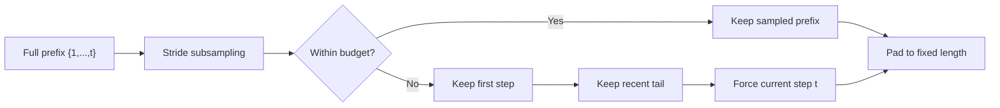
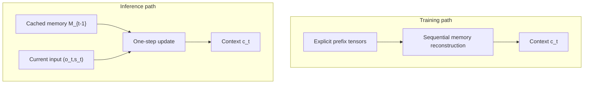

# Plug-and-Play Prefix Memory Module for Action Experts

## 摘要

根据新的方法学定位，本文将仓库中的 `streaming_act` 重新表述为一个**可插拔前缀记忆模块**，而不是仅仅面向 ACT 的专用结构。核心思想是：将“历史建模”与“动作专家”解耦。具体地，我们把任意动作策略主干记作一个 action expert $\mathcal E_\psi$，其职责是根据当前观测生成动作；同时引入一个独立的 prefix memory module $\mathcal M_\theta$，其职责是在固定预算下对完整历史前缀进行流式压缩，并把得到的历史上下文以 token、adapter、FiLM 或条件向量等形式注入 $\mathcal E_\psi$。在这种写法下，ACT 只是一个具体实例，而非算法定义本身。该改写的优点是：方法更具一般性，更容易扩展到 diffusion policy、autoregressive transformer policy、MLP/RNN policy 等不同类型的 action expert，也更符合“plug and play memory module”的叙事。

---

## 1. 重新定义问题：从“ACT 变体”到“通用记忆插件”

设当前观测为

$$
x_t = (o_t, s_t),
$$

其中 $o_t$ 是视觉观测，$s_t$ 是低维状态。设任意动作专家为

$$
\hat y_t = \mathcal E_\psi(x_t),
$$

其中 $\hat y_t$ 可以表示：

- 单步动作；
- 长度为 $K$ 的动作块；
- 一个动作分布或噪声预测目标。

传统方法把历史建模逻辑直接耦合进具体专家内部，因此当策略主干改变时，历史模块往往也需要重写。我们希望把问题改写成：

$$
\hat y_t = \mathcal E_\psi(x_t; c_t),
$$

其中 $c_t$ 是由独立 prefix memory module 产生的历史条件：

$$
c_t = \mathcal A_\theta(H_t, O_t),
$$

这里：

- $H_t = \{s_1,\dots,s_t\}$ 表示状态前缀；
- $O_t = \{o_1,\dots,o_t\}$ 表示视觉前缀；
- $\mathcal A_\theta$ 表示一个与具体 action expert 解耦的历史摘要模块。

因此，新的算法叙事变成：

> 我们提出一个可插拔的 prefix memory module。它持续维护对完整前缀历史的固定预算摘要，并通过标准化接口向任意动作专家提供历史条件。

---

## 2. 总体框架

### 2.1 高层分解

我们将完整方法分成两个相互独立的部分：

1. **Action Expert $\mathcal E_\psi$**
   - 只负责“如何把当前输入和条件上下文映射为动作”；
2. **Prefix Memory Module $\mathcal M_\theta$**
   - 只负责“如何在固定预算下压缩历史前缀，并形成条件上下文”。

因此，最终策略写为

$$
\hat y_t
=
\mathcal E_\psi\!\left(
x_t;\,
\mathcal C_\theta(g_t,\Delta g_t,M_t)
\right),
$$

其中：

- $g_t$ 是状态前缀摘要；
- $\Delta g_t$ 是增量摘要；
- $M_t$ 是视觉前缀记忆；
- $\mathcal C_\theta(\cdot)$ 是把历史摘要转换为 expert 可消费条件的 adapter。

### 2.2 高层结构图

*图 1. 新的 plug-and-play 视角。Prefix memory module 独立维护历史摘要，并通过统一条件接口向 action expert 提供上下文。*

---

## 3. Prefix Memory Module 的数学定义

### 3.1 状态前缀摘要

记状态前缀为

$$
H_t = \{s_1, s_2, \dots, s_t\}.
$$

我们用一个前缀编码器对其进行压缩：

$$
g_t = \Phi_{\text{sig}}(H_t).
$$

在当前仓库中，$\Phi_{\text{sig}}$ 对应 path signature 编码；在更一般的形式下，它也可以是任意固定维度的前缀摘要器。

进一步定义增量摘要：

$$
\Delta g_t = g_t - g_{t-1},
$$

其中初始步取零向量。  
直觉上，$g_t$ 描述“到目前为止走过了怎样的路径”，而 $\Delta g_t$ 描述“最近一次前缀摘要发生了怎样的变化”。

### 3.2 视觉前缀记忆

记固定预算视觉记忆为

$$
M_t \in \mathbb R^{B \times d},
$$

其中 $B$ 是 memory slots 数量，$d$ 是隐空间维度。  
该记忆通过递推更新：

$$
M_t = \mathcal U_\theta(M_{t-1}, o_t, s_t, g_t, \Delta g_t).
$$

若把各个输入先编码到统一隐空间，则可写成

$$
z_t =
\left[
\phi_v(o_t),\,
\phi_s(s_t),\,
\phi_g(g_t),\,
\phi_{\Delta}(\Delta g_t)
\right],
$$

$$
M_t^{(b)} = \mathrm{GRU}^{(b)}(z_t, M_{t-1}^{(b)}),
\qquad b=1,\dots,B.
$$

在当前实现中，这就是 visual prefix memory 的基本形式；但在更一般的写法中，$\mathcal U_\theta$ 也可以被 attention writer、slot memory、SSM 等替代。

### 3.3 条件 adapter

为了适配不同 action expert，我们不直接把 $(g_t,\Delta g_t,M_t)$ 绑定到某一种主干，而是定义一个中间 adapter：

$$
c_t = \mathcal C_\theta(g_t, \Delta g_t, M_t).
$$

这个 $c_t$ 可以是：

- 一组额外 token；
- 一个全局条件向量；
- FiLM 参数；
- cross-attention key/value；
- 或 hidden-state initializer。

因此，plug-and-play 的关键不是 memory 本身，而是：

> **memory module 输出的是一种“标准化历史条件”，而不是绑定到某一专家架构的私有结构。**

---

## 4. Prefix Memory Module 的内部结构

*图 2. Prefix memory module 的模块化内部结构。状态摘要、增量摘要和视觉记忆更新均属于独立插件内部逻辑。*

---

## 5. 为什么它是 Plug and Play

### 5.1 与动作专家解耦

在新的写法中，action expert 只需要满足一个非常弱的接口条件：

$$
\hat y_t = \mathcal E_\psi(x_t; c_t).
$$

也就是说，任意专家只要能够接收某种附加条件 $c_t$，就可以与该记忆模块配合。  
因此，方法的核心不再是“设计一个新的 ACT”，而是“设计一个通用的历史条件插件”。

### 5.2 可插拔的几种典型方式

| Action Expert 类型 | 可插拔方式 | 对应的 $c_t$ 形式 |
| --- | --- | --- |
| ACT / Transformer chunk policy | 额外 memory token / encoder FiLM | token 序列、FiLM 参数 |
| Diffusion Policy | 额外 condition embedding / cross-attention context | condition vector、context tokens |
| Autoregressive policy | prefix token / KV condition | prefix tokens、KV memory |
| MLP / BC policy | 条件拼接 | 全局向量 |
| RNN policy | hidden-state initialization / gating | 初始化状态、门控向量 |

### 5.3 专业表述

从方法论上，最合适的叙述是：

> 我们提出的是一个**专家无关（expert-agnostic）**的 prefix memory module，它向上提供统一历史条件接口，向下仅依赖当前观测与历史前缀，因此可以作为插件附加到不同类型的 action expert 上。

---

## 6. 训练时的 prefix reconstruction

为了让模块在训练时学到真正的在线递推关系，需要为每个时刻显式构造前缀样本。给定当前位置 $t$，构造：

$$
P_t = \{1,\dots,t\}.
$$

然后用预算约束形成训练前缀：

$$
\tilde P_t = \mathrm{SampleAndPad}(P_t; L, r),
$$

其中：

- $L$ 为 `prefix_train_max_steps`；
- $r$ 为 `prefix_frame_stride`。

当前实现采用的规则是：

1. 按固定步长对子序列采样；
2. 始终保留当前时刻；
3. 若超预算，则保留第一个前缀位置与最近的尾部位置；
4. 右侧 padding 并生成 mask。

*图 3. 训练前缀构造。该规则保留早期 cue 与近期 tail，从而兼顾长期身份线索与当前局部状态。*

---

## 7. 训练与推理一致性

训练时，使用显式前缀序列扫描得到

$$
M_t = \mathrm{ScanPrefix}(\tilde P_t).
$$

推理时，则通过在线递推得到

$$
M_t = \mathcal U_\theta(M_{t-1}, o_t, s_t, g_t, \Delta g_t).
$$

因此两者学的是同一个对象：对完整前缀历史的固定预算压缩表示。区别仅在于训练时为便于并行，显式提供前缀；推理时为便于部署，递推维护状态。

*图 4. 训练与推理一致性。上下两条路径最终产出相同语义的条件上下文 $c_t$。*

---

## 8. ACT 只是一个具体实例

在仓库当前实现中，action expert 采用 ACT，因此：

$$
\hat{\mathbf a}_{t:t+K-1}
=
\mathcal E_{\psi}^{\text{ACT}}(x_t; c_t).
$$

其中 $c_t$ 被具体实现为：

1. `signature token`；
2. `delta-signature token`；
3. `anchor token`；
4. `visual prefix memory slots`；
5. 可选的 encoder-side FiLM conditioning。

在这种实例化下，decoder memory 可以写为

$$
C_t
=
\left[
e_t^{(\text{anchor})},
e_t^{(g)},
e_t^{(\Delta g)},
M_t,
\mathrm{Enc}(x_t)
\right].
$$

若启用 memory-conditioned FiLM，则还存在

$$
\tilde X_t
=
X_t \odot (1+\tanh(\gamma_t)) + \beta_t,
\qquad
[\gamma_t,\beta_t] = \Psi(M_t).
$$

因此，在仓库实现里我们看到的是“memory module + ACT expert”的组合；但算法定义本身应当上升为“memory module + arbitrary expert”的组合。

---

## 9. 训练目标

若 action expert 的输出是动作块，则主损失可以写为

$$
\mathcal L_{\text{task}}
=
\frac{1}{|\Omega|}
\sum_{(t,k)\in \Omega}
\left\|
\hat a_{t+k} - a_{t+k}^{*}
\right\|_1.
$$

若使用 VAE 式 ACT 实例化，则进一步有

$$
\mathcal L
=
\mathcal L_{\text{task}}
+
\lambda_{\mathrm{KL}}\mathcal L_{\mathrm{KL}}.
$$

若未来把该模块迁移到 diffusion expert、autoregressive expert 或 value-conditioned policy，上式中的 $\mathcal L_{\text{task}}$ 可替换为对应主干原本的任务损失，而 memory module 无需重写。

这正是 plug-and-play 叙事下最重要的一点：

> **memory module 的定义不依赖具体 expert 的训练目标。**

---

## 10. 复杂度与优势

### 10.1 固定预算历史表示

若显式历史长度为 $T$，memory slots 数量为 $B$，签名维度为 $d_{\text{sig}}$，则历史状态的存储开销为

$$
\mathcal O(Bd + d_{\text{sig}}),
$$

而不是随 $T$ 增长的 $\mathcal O(T)$。

### 10.2 专家无关性

该模块可在不改变专家主干定义的前提下接入不同策略，因此具备：

1. **可迁移性**：从 ACT 扩展到不同 policy family；
2. **可复用性**：同一个历史模块可用于多个 expert；
3. **低侵入性**：仅需定义 context adapter，而无需重构整个主干。

### 10.3 长时依赖友好

该模块强调的是“完整前缀压缩”，因此比固定窗口更适合早期 cue 决定后续分支的任务；同时又避免了事件记忆库的增长性与检索复杂度。

---

## 11. 推荐的写作表述

如果要向导师或审稿人介绍该方法，更推荐使用下面这种表述：

> We propose a plug-and-play prefix memory module for action experts. The module maintains a fixed-budget streaming summary of the full execution prefix, including a state-prefix summary and a visual prefix memory. At each decision step, the module produces a generic conditioning signal that can be consumed by different action experts, such as ACT-style chunking policies, diffusion policies, autoregressive policies, or recurrent control networks. This design decouples historical context modeling from expert-specific action generation, making the memory mechanism reusable across policy families.

对应的中文表达可以写成：

> 我们提出一个面向 action expert 的可插拔前缀记忆模块。该模块以固定预算持续压缩完整执行前缀，形成状态前缀摘要与视觉前缀记忆，并在每个决策时刻向动作专家输出统一的历史条件信号。由于该条件接口与具体专家主干解耦，该模块可以方便地扩展并应用到 ACT、diffusion policy、自回归策略以及循环控制网络等不同类型的动作专家上。

---

## 12. 结论

在新的叙事下，本方法不应再被写成“某个专门针对 ACT 的 trick”，而应写成：

$$
\text{Plug-and-Play Prefix Memory Module}
+
\text{Action Expert}.
$$

其中：

- prefix memory module 负责历史建模；
- action expert 负责动作生成；
- 二者通过统一条件接口相连接。

因此，仓库中的 `streaming_act` 更适合作为该思想的一个**ACT 实例化版本**来呈现，而算法本身应当上升为：

> **一种可插拔、专家无关、固定预算、流式更新的前缀记忆模块。**

这会让方法在论文表述上更通用，也更容易支撑“可扩展到不同类型 action expert”的研究主线。

---

## 附：当前仓库中的对应关系

| 抽象模块 | 当前仓库中的实例 |
| --- | --- |
| Prefix memory module | `main/policy/lerobot_policy_streaming_act/src/lerobot_policy_streaming_act/modeling_streaming_act.py` 中的 signature + visual prefix memory |
| Prefix reconstruction | `main/policy/lerobot_policy_streaming_act/src/lerobot_policy_streaming_act/prefix_sequence.py` |
| ACT expert | 同文件中的 ACT encoder/decoder/chunk head |
| Expert-specific adapter | decoder memory token 注入 + encoder FiLM |
| 训练接线 | `main/scripts/train_policy.py` |
| 评估接线 | `main/scripts/eval_policy.py` |

